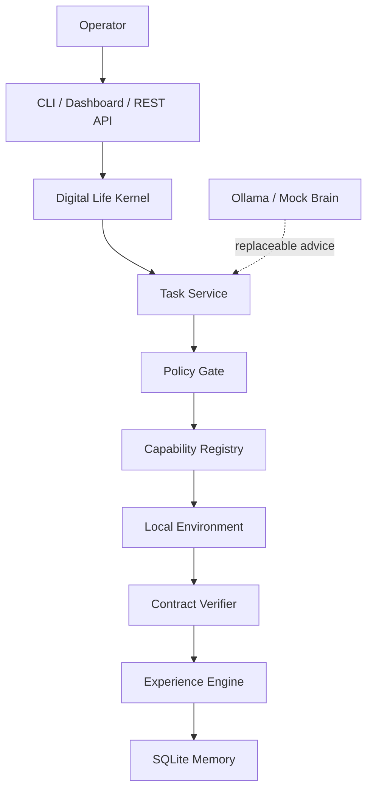
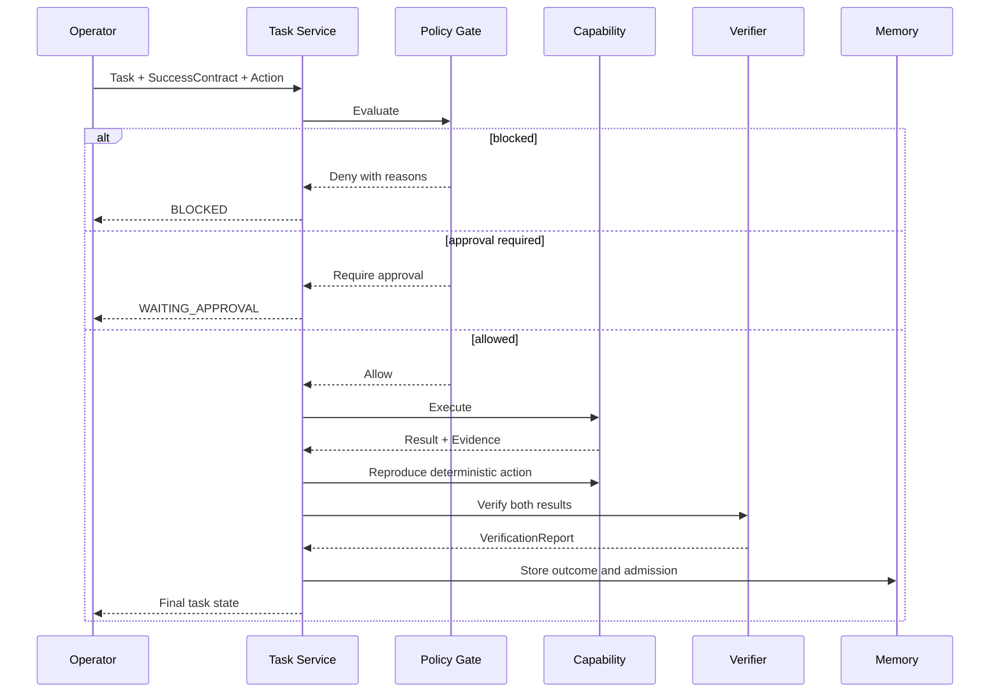
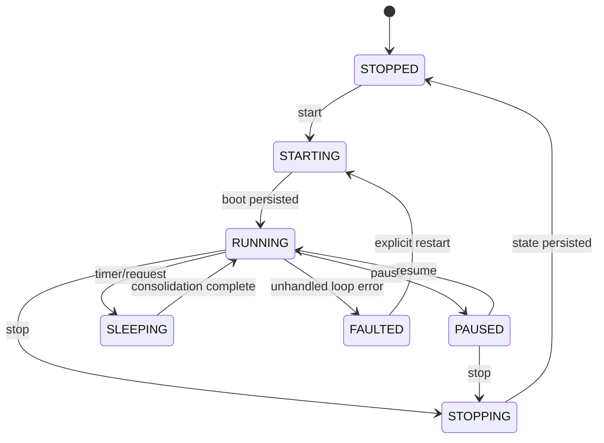

# Volume II — Architecture Specification

**版本：** 0.1.0  
**狀態：** Implemented核心架構；Prediction/Planner部分為Future

## 1. 架構目標

架構必須同時滿足：

- 程序重啟後狀態可恢復；
- 模型與生命核心解耦；
- 行動前強制成功契約與風險判定；
- 結果由外部證據驗證；
- 經驗與技能准入可追蹤；
- 每項重要狀態轉移可Replay；
- 預設本機、安全且可測試；
- 未來可加入World Model、Planner與具身裝置而不推翻核心。

## 2. 系統情境



Brain不能直接存取Environment。所有可執行行動都必須經Task Service、Policy Gate及Capability Registry。

## 3. 容器與模組

| 模組 | 責任 | v0.1實作 |
| --- | --- | --- |
| `kernel` | 生命週期、Heartbeat、Sleep、任務輪詢 | Implemented |
| `domain` | 不可變契約、列舉、輸出模型 | Implemented |
| `storage` | 事件、任務、核准、Experience、Knowledge、Reflection、Skill | Implemented |
| `events` | 先持久化、後通知、Replay | Implemented |
| `policy` | 風險分類、工作區邊界、Fail Closed | Implemented |
| `capabilities` | 註冊與執行allowlisted能力 | Implemented |
| `verification` | 契約檢查、證據、重現 | Implemented |
| `memory` | 經驗准入、知識帳本、固定反思、技能結晶 | Implemented |
| `brain` | Mock/Ollama可替換模型介面 | Implemented |
| `api` | REST、OpenAPI、靜態Dashboard | Implemented |
| `services` | 任務與驗收用例協調 | Implemented |
| Prediction/WAM | 反事實結果預測 | Future |
| Planner | 多步候選規劃與成本配置 | Future |
| Generative Reflector | 自主失敗分類、根因假設與實驗提案 | Future |
| Curiosity | 主動選擇資訊增益任務 | Future |

## 4. 主要資訊流



### 不變量

1. `Capability.execute`不得被API直接呼叫。
2. Task在執行前必須已持久化。
3. Policy拒絕後不得建立Capability副作用。
4. VerificationReport必須連結Evidence ID。
5. Experience不刪除失敗，但只提升合格成功。
6. Skill Active不由模型文字決定。

## 5. 持久化架構

SQLite採用WAL、foreign keys、busy timeout與`FULL`同步。每個Store方法建立短生命連線，避免跨執行緒共用單一連線。v0.1表：

- `events`
- `kernel_state`
- `tasks`
- `approvals`
- `experiences`
- `skills`
- `observations`

事件採SHA-256鏈：

```text
event_hash = SHA256(
  previous_hash |
  event_id |
  event_type |
  aggregate_id |
  correlation_id |
  canonical_payload_json |
  created_at
)
```

這能偵測事後修改或插入，不提供數位簽章、身分鑑別或對具有資料庫寫入權限攻擊者的完整防護。Experimental Rust verifier可獨立驗證JSONL匯出。

## 6. 生命週期狀態



Kernel Runtime一次只處理一項queued task。這是v0.1為了確定性與安全採用的限制，不是效能最佳化。

## 7. 安全邊界

### 應用層

- 未註冊Capability拒絕。
- system file mutation拒絕。
- network capability預設拒絕。
- 工作區外路徑拒絕。
- 成本超約拒絕。
- High/Critical要求核准。
- model self-report不算外部證據。

### 容器層

- root filesystem read-only；
- `cap_drop: ALL`；
- `no-new-privileges`；
- `/tmp`使用有限tmpfs；
- 對外只發布`127.0.0.1:8420`；
- data與workspace使用獨立volume。

容器層仍不是敵對程式的完整沙盒，所以v0.1不提供任意Shell或一般Python執行。

## 8. 替換點

### BrainProvider

```python
health() -> BrainHealth
chat(messages, format_schema=None) -> BrainResponse
```

### Capability

```python
definition: CapabilityDefinition
execute(action: ActionProposal) -> CapabilityResult
```

### 未來替換

- SQLite可替換PostgreSQL/EventStore，但必須保持事件順序與hash語意。
- Ollama可替換llama.cpp/vLLM，只能透過BrainProvider。
- Dashboard可替換，不得直接寫資料庫。
- Verifier可加入形式證明，但不能降低外部證據要求。

## 9. 非功能需求

- API預設localhost。
- 所有核心Pydantic模型`extra=forbid`且frozen。
- Python支援3.11與3.12。
- 單元與整合測試涵蓋率門檻80%。
- MyPy strict與Ruff必須通過。
- Docker停止寬限20秒。
- 事件鏈損壞時Health降級。

## 10. 已知限制

- SQLite不適合多主節點寫入。
- Heartbeat會增加事件數；長期需分區/壓縮策略。
- Approval尚無使用者身分與密碼驗證，只能在localhost使用。
- GridWorld能力直接取得完整grid以模擬探索成本，尚非部分可觀測世界。
- Mock/Ollama尚未參與成功契約生成。
- Skill fingerprint由能力輸出提供，未來需由可信Canonicalizer生成。
