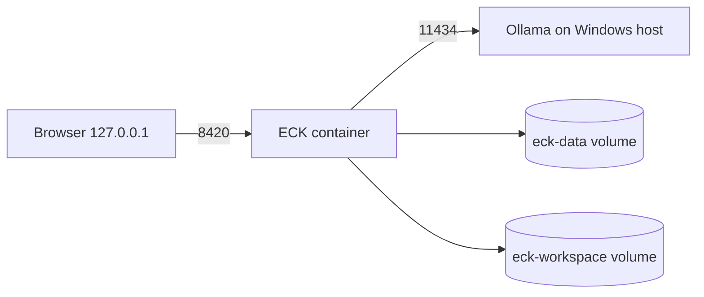

# Volume X — Runtime & Infrastructure

**版本：** 0.1.0  
**狀態：** Windows/WSL2/Docker與Native Python為Implemented配置

## 1. 目標平台

- Windows 11
- WSL2
- Docker Desktop
- NVIDIA RTX 4070 Ti SUPER 16GB
- 64GB RAM
- 1.2–1.5TB可分配NVMe

ECK應用容器不包含Ollama或GPU runtime。Ollama在Windows host運行，ECK透過`host.docker.internal:11434`連線。這樣模型安裝與ECK生命資料彼此獨立。

## 2. Docker topology



Compose不把Ollama port發布到其他網路。ECK API只以`127.0.0.1:8420:8420`映射。

## 3. Container hardening

- `read_only: true`
- `user=eck`, UID/GID 10001
- `cap_drop: ALL`
- `no-new-privileges:true`
- `/tmp` 256MB tmpfs
- data/workspace獨立named volumes
- stop grace 20秒
- healthcheck每30秒

`ECK_ALLOW_REMOTE_BIND=true`只允許容器內Uvicorn監聽`0.0.0.0`；Host publishing仍限制localhost。若使用者改Compose port到`0.0.0.0`，即超出支援安全範圍。

## 4. Configuration precedence

由高到低：

1. `Settings(...)`程式參數
2. `ECK_`環境變數
3. `.env`
4. `config/eck.yaml`
5.模型預設值

可以用`ECK_CONFIG_FILE`指定另一個YAML。

### 關鍵設定

| Key | Default | 說明 |
| --- | --- | --- |
| identity | eck-local | 持久身分 |
| bind_host | 127.0.0.1 | Native安全預設 |
| bind_port | 8420 | Dashboard/API |
| brain_provider | ollama | 可改mock |
| ollama_model | null | 必須由使用者指定 |
| network_enabled | false | Capability網路閘 |
| system_file_mutation_enabled | false | v0.1保持false |
| heartbeat_seconds | 5 | 生命訊號 |
| sleep_cycle_seconds | 3600 | Memory cycle |

## 5. Windows安裝

### Prerequisites

1. Windows 11已啟用虛擬化。
2. 安裝WSL2與Ubuntu。
3. Docker Desktop使用WSL2 engine。
4. Ollama已安裝並由使用者自行pull合適模型。

### Setup

```powershell
Copy-Item .env.example .env
notepad .env
.\scripts\setup-windows.ps1
.\scripts\start-windows.ps1
```

`.env`至少設定：

```dotenv
ECK_OLLAMA_MODEL=<ollama list顯示的完整名稱>
```

ECK不要求Brain available才能啟動其他核心功能。

## 6. Native development

```bash
python -m venv .venv
source .venv/bin/activate
python -m pip install -e ".[dev]"
ECK_BRAIN_PROVIDER=mock eck serve
```

Native模式資料寫入`data/eck.db`，工作區為`workspace/`。

## 7. Storage sizing

模型由Ollama管理，不計入ECK volume。v0.1文字事件很小，但5秒Heartbeat每日約17,280筆。長期部署應：

- 將Heartbeat間隔提高到30–60秒；
-監控DB大小；
-定期備份；
-在實作Archive前不要自行刪event row。

預留1.2TB足夠研究，但不代表應無限制保存。

## 8. Backup與Restore

v0.1建議：

1.乾淨停止ECK。
2.使用Docker volume backup或SQLite backup API。
3.保存`.env`但不要公開敏感設定。
4. Restore到新volume。
5.啟動後檢查`/health` event chain。
6.執行三項驗收。

直接複製正在WAL寫入的單一`.db`檔可能遺漏`-wal`內容，不建議。

## 9. Observability

目前：

- `/health`
- KernelStatus
- event timeline
- Task/Experience/Knowledge/Reflection/Skill API
- Uvicorn log

未來：

- Prometheus metrics；
- structured logs；
- OpenTelemetry trace；
- VRAM/CPU/disk監控；
- approval latency；
- verifier failure distribution。

Observability資料不能包含完整私人prompt或秘密。

## 10. Failure recovery

| 故障 | 處理 |
| --- | --- |
| Ollama停止 | Brain unavailable；Kernel不停止 |
| 容器重啟 | restart unless-stopped；boot count增加 |
| 非乾淨停止 | KernelRecovered |
| event hash錯誤 | Health degraded；停止信任後續學習 |
| data volume滿 | 寫入失敗，Kernel Faulted；人工處理 |
| model OOM | Brain request失敗；不影響事件歷史 |

## 11. Production限制

v0.1不支援：

- 公開Internet API；
-多使用者登入；
-多節點Active-Active；
-Kubernetes；
-遠端資料庫；
-自動秘密管理；
-GPU容器內Ollama；
-服務等級保證。
