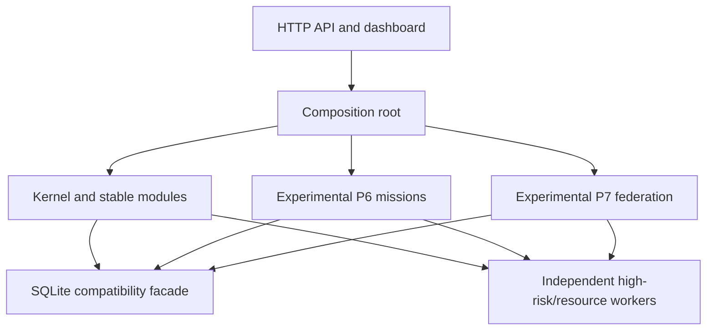

# Architecture Stabilization Baseline

## Status

ECK is a modular monolith. Image generation, video generation, browser automation, and
untrusted code execution remain independent workers because they are resource-heavy or
high-risk. P6 durable missions and P7 federation are explicitly experimental modules.

This stabilization phase changes internal ownership without changing existing SQLite data,
REST routes, or runtime-skill manifests.

## Module boundaries



Stable bounded modules may depend on domain models and explicit ports. They must not import
the API, dashboard, or experimental implementation packages. The application composition
root is the only normal place where stable and experimental modules are wired together.

## Compatibility contracts

- The v0.1.0 method/path surface is hashed in `config/architecture-baseline.json`.
- New routes are additive and listed separately; existing routes cannot disappear silently.
- Old P6/P7 Python import paths remain thin facades during the deprecation period.
- `RuntimeSkillManifest` remains the persisted and federated skill contract.
- Learned experience skills and executable runtime skills are exposed through
  `skill-lifecycle.v1` without rewriting either legacy table.

## SQLite migration gate

Every schema migration must run through:

1. SQLite hot backup of the old database.
2. Upgrade of a working copy only.
3. `integrity_check` and `foreign_key_check`.
4. Preservation checks for every old table, column, row count, and old-column value.
5. Backward-compatible schema comparison; additive tables and columns are allowed.
6. Rollback restoration and snapshot equality verification.
7. Proof that the source database was not modified.

Run:

```powershell
.\.venv\Scripts\python.exe scripts\verify_sqlite_migration.py `
  data\eck.db artifacts\migration-verification
```

When ECK is actively appending heartbeats, pass `--allow-live-source`. The verifier still uses a
single hot-backup snapshot for upgrade and rollback checks, while reporting that the live source
advanced during the audit.

## Completed stabilization slices

The first debt-repayment pass is complete without changing the public SQLiteStore class,
REST method/path surface, mission executor class, or Project Lab service class:

1. `SQLiteStore` delegates to event/task, learning, mission, and runtime/research repositories.
2. `api/main.py` is a composition layer; system, learning, runtime, research, and record routes
   live in focused routers.
3. P6 execution is separated into planning, execution, software orchestration, artifact logic,
   and common typed context.
4. Project Lab is separated into lifecycle, drafting, validation, GitHub, and support adapters.
5. Dashboard HTTP, formatting, mission-draft state, and slash-command state are TypeScript
   modules with browser-ready ES module outputs.

New Python and frontend files must stay below the default line budget. Remaining legacy files
above the default are line-ratcheted and cannot grow. CI runs `scripts/check_architecture.py`,
all existing tests, strict MyPy, Ruff, migration-copy tests, and REST compatibility checks.

The next refactor slices remain behavior-preserving:

1. Split image-generation provider selection from worker lifecycle and artifact validation.
2. Split P6 quality council prompts from deterministic scoring and review persistence.
3. Split P7 federation transport from pack admission and local installation.
4. Continue moving dashboard rendering sections into typed view components.
5. Replace temporary experimental mixin contexts with explicit component protocols.
