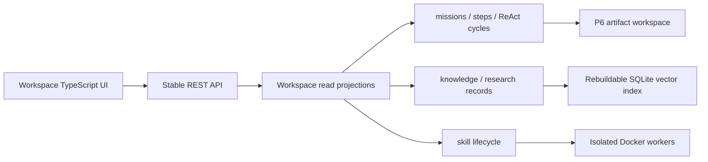

# ECK Workspace Architecture

Status: Phase 1 accepted; Library and Skills foundations implemented

## 1. Product objective

ECK Workspace changes the primary experience from an engineering dashboard into an
output-oriented local AI workspace. The primary navigation is Home, Projects, ECK Library,
Skills, and More.

The information hierarchy takes inspiration from the general outcome-oriented pattern used by
modern AI workspaces: ask once, see active work, open durable project context, and inspect a
finished artifact. It does not reuse another product's brand, copy, layout, or visual assets.

## 2. Current-state audit

### Directly reusable capabilities

| Workspace need | Existing authority | Reuse decision |
| --- | --- | --- |
| Natural-language chat and intent routing | `DialogueService`, `/v1/chat` | Reuse without a second router. Slash commands remain optional shortcuts. |
| Durable large tasks | `missions`, `mission_steps`, `mission_react_cycles`, P6 | A mission is the only authoritative Workspace project. |
| Atomic execution | `tasks` and capability registry | Tasks remain internal or small executable units; they are not duplicate projects. |
| Project artifacts | P6 mission workspace, preview and package routes | Reuse preview and download URLs. Do not copy artifacts into a second result store. |
| Human acceptance | Mission completion and review API | Reuse for Workspace review and revision. |
| Verified knowledge | `knowledge_items`, research sources and RAG | Library is a projection of these records. RAG remains a derivative index. |
| Learned procedures | `skills`, `runtime_skills`, skill lifecycle and graph | Skills page reads the unified lifecycle projection. |
| Federation | P7 Evolution Packs and Registry | Move to More; no duplicate federation client. |
| System controls | kernel, local-service and resource APIs | Move to More and load only on demand. |
| Portability | CognitiveBundle and Evolution Packs | Reuse for future Workspace export and migration. |

### Missing capabilities

1. A low-cost Workspace home projection that does not request every engineering endpoint.
2. A paginated project list and one project-detail envelope.
3. General draft persistence for the global composer, project creation, feedback, and editing.
4. Output-first artifact browsing for non-website deliverables.
5. A Library editorial projection with cards, chapters, books, revisions, counterexamples,
   unresolved questions, and static caches.
6. Explicit task-to-skill usage records for showing which skills completed each project.
7. NAS lifecycle metadata for archived artifacts.

### Overlapping concepts and their boundaries

| Existing concepts | Conflict risk | Workspace rule |
| --- | --- | --- |
| tasks / missions / challenges | Three things can look like a user task. | Mission = durable project; task = atomic execution; challenge = governed target that may link missions. |
| P5 development projects / P6 missions | Two project workspaces. | P5 remains an implementation helper. User-facing projects are P6 missions only. |
| knowledge / RAG documents | Search index can appear to be a second memory. | SQLite knowledge and research records are authoritative; RAG is rebuildable. |
| skills / runtime skills / skill graph | Three skill lists can disagree. | Skill lifecycle is the read model; underlying tables and graph remain unchanged. |
| mission evidence / project files / generated media | Results can be scattered. | Phase 1 links existing artifact routes; a later artifact catalog will index, not copy, files. |

### Architecture conflicts found

1. The legacy dashboard executes a broad refresh every five seconds and requests about fifteen
   endpoints even when the user only views the home page.
2. `dashboard/app.js` combines routing, data fetching, rendering, chat, missions, learning,
   evaluation, roadmap, and system control in one file.
3. Mission review drafts are preserved, but the global composer and project-create form do not
   share one explicit draft contract.
4. The current home page exposes supervisor and engineering detail before outcomes.
5. Lists use fixed recent-item slices rather than a common pagination contract.
6. P6 and P7 are experimental packages; Workspace must consume their REST facades rather than
   browser-facing internal implementation.

None of these conflicts requires a new task, knowledge, skill, or result database.

## 3. Architectural decisions

### 3.1 Data authority

- The frontend never reads SQLite or local paths.
- Workspace read services aggregate existing authorities; they do not own records.
- Mutations continue through existing mission, chat, review, skill, and system APIs.
- Existing REST routes, SQLite rows, and skill manifests remain valid.

### 3.2 Phase 1 API

- `GET /v1/workspace/home`: kernel, current activity, structured reasoning summary, up to four
  running projects, recent accepted/review results, learning counts, and cached resource pressure.
- `GET /v1/workspace/projects`: offset pagination over existing missions.
- `GET /v1/workspace/projects/{project_id}`: mission, steps, structured ReAct summaries, and
  existing preview/download links.
- `GET /v1/workspace/system`: on-demand service state, quick host resources, and the latest cached
  project-size measurement without starting a recursive filesystem scan.

The API returns a recommended polling interval. The browser pauses polling while hidden.

### 3.3 Draft persistence

Unsubmitted text is browser-local and never represented as completed work. The TypeScript draft
store uses namespaced keys and persists the home composer, project-create fields, project review
feedback, and project revision notes.

Drafts are saved on input and page lifecycle transitions. They are cleared only after a successful
request or explicit user action.

### 3.4 Structured reasoning display

Only goal, plan, action, observation, correction, verification, and conclusion may appear.
Private chain-of-thought is neither requested nor displayed. Empty fields are shown as unavailable,
not filled by animated or invented progress.

### 3.5 Resource policy

- Home uses one aggregate request, normally every 30 seconds when idle and 5 seconds while busy.
- Hidden pages do not poll.
- Projects are paginated; details load only when opened.
- More reads the latest cached project-size measurement; recursive scans remain explicit and never
  run as a side effect of rendering a page.
- Forge, video workers, RAG, and models retain their existing on-demand lifecycle.
- Images use native lazy loading.

## 4. Phased implementation plan

### Phase 1 — Workspace shell and projects

1. Add stable Workspace read projections.
2. Replace engineering-first navigation with Home, Projects, Library, Skills, and More.
3. Make the global composer the visual priority.
4. Add active work, recent outcomes, and truthful structured activity.
5. Add paginated projects, project details, artifact links, and review controls.
6. Preserve all unsubmitted Workspace drafts across refreshes.
7. Replace fixed five-second global polling with view-aware scheduling.

### Phase 2 — Library and outcomes

1. Build cards from admitted knowledge and research evidence.
2. Incrementally generate chapter and book manifests in Markdown/JSON.
3. Add hashes, sources, counterexamples, confidence, revision history, unresolved questions, and
   verification status.
4. Add a result browser that indexes current artifacts without copying them.

### Phase 3 — Skills workspace

1. Present memory, runtime, candidate, failed, and retired skills through one lifecycle view.
2. Add source, version, permissions, tests, capability scope, and activation history.
3. Record task-to-skill usage so project pages can prove which skill contributed.
4. Use the same lifecycle projection for automatic mission matching.

### Phase 4 — Storage lifecycle and NAS

1. Add artifact inventory metadata and content hashes.
2. Add archive eligibility and NAS location metadata.
3. Keep previews available through stable API routes after archival.
4. Verify restore, integrity, and rollback without changing mission identity.

### Phase 5 — Frontend consolidation

1. Finish TypeScript component migration.
2. Remove the unused legacy dashboard controller after feature parity tests pass.
3. Add list virtualization only where measured list size justifies it.
4. Ratchet bundle size, request count, idle polling, and render-time budgets.

## 5. Compatibility and migration

- Phase 1 adds no SQLite table or column.
- Existing database copies open without migration.
- Existing P6 project files and mission IDs remain unchanged.
- Existing clients continue using all prior REST routes.
- Existing skill manifests and Evolution Packs remain unchanged.
- Rollback consists of serving the prior static frontend; no data rollback is required for Phase 1.

## 6. Phase 1 acceptance gates

1. Existing Python tests pass.
2. Workspace API tests prove pagination, project detail, and old-data readability.
3. Frontend TypeScript passes strict type checking.
4. Draft-store tests prove values survive store reconstruction and clear only explicitly.
5. The live app verifies chat, project creation, detail, preview/download availability, and controls.
6. Hidden-page and idle-refresh behavior does not issue the legacy global five-second query fan-out.
