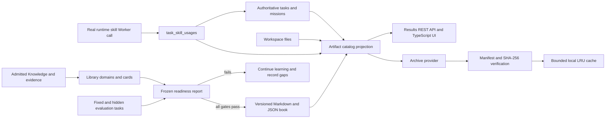

# ECK Workspace Phase 2

Status: implemented, backward-compatible, pending the v0.2 release gate.

## 1. Audit and conflict analysis

### Directly reused authorities

| Concern | Existing authority | Phase 2 use |
|---|---|---|
| Tasks and outcomes | `tasks` plus Success Contract and verification | Artifact provenance, skill-use task links, Library evaluation |
| Durable projects | P6 `missions`, steps, ReAct cycles, mission workspaces | Project/result navigation and project artifact indexing |
| Knowledge | `knowledge_items`, task evidence, reflections | Knowledge cards and formal book claims |
| Retrieval | Portable RAG SQLite/`sqlite-vec` projection | Retrieval only; no new Library knowledge database |
| Skills | Runtime Skill Manifest and skill lifecycle | Exact version and execution provenance |
| Media/files | Existing image, video, export, project and mission paths | Rebuildable artifact catalog |
| Portability/Federation | CognitiveBundle and Evolution Pack services | Future transfer of metadata and verified books |

### Missing capabilities implemented

- One artifact catalog across projects, images, videos, documents, packages and books.
- A filesystem Archive Storage Provider with manifest, SHA-256 verification, rollback and LRU cache.
- A task-skill execution ledger written only around a real isolated Worker call.
- Domain, card relation, readiness report, formal book revision and suggestion metadata.
- TypeScript result and formal Library workspaces.

### Duplicate or conflicting behavior removed

- The former Library projection called its aggregate Markdown output a book. It is now explicitly a
  non-formal Knowledge Catalog. A formal book requires a passed readiness report.
- Runtime skill usage was previously inferred from task names and action payloads in the skill page.
  Runtime usage now comes from `task_skill_usages` only.
- The retired dashboard `app.js` duplicated TypeScript behavior and has been removed after parity
  tests. The browser loads only compiled TypeScript modules.

### Intentionally not duplicated

- Artifact bytes and model weights are never stored in SQLite.
- Book claims are not a second Knowledge ledger. Revisions cite admitted Knowledge IDs.
- Library suggestions are not facts. They create revision missions and require new verification.
- P6 actions are not labeled as skill usage unless a runtime skill Worker actually executes.

## 2. Data flow



## 3. Supplementary SQLite schema

The migration is additive. Existing REST contracts, tables and skill manifests remain unchanged.

| Table | Purpose | Authority status |
|---|---|---|
| `artifact_index` | Path/hash/type/source projection | Rebuildable index |
| `task_skill_usages` | Actual Worker execution ledger | Execution provenance |
| `archive_records` | Archive operation and manifest state | Archive audit record |
| `artifact_cache_entries` | LRU/use-lock metadata | Rebuildable cache state |
| `library_domains` | Domain selector, status and frozen thresholds | Library workflow metadata |
| `library_domain_cards` | Domain-to-Knowledge relation | Relation only |
| `knowledge_relations` | Verified card graph | Relation only |
| `library_readiness_reports` | Immutable gate results | Evaluation record |
| `library_books` | Formal book identity | Publication metadata |
| `library_book_revisions` | Version/hash/file pointers | Version metadata |
| `library_suggestions` | Persistent user request and mission link | Workflow metadata |

`SQLiteMigrationVerifier` upgrades a hot backup, compares every existing row and column, runs
integrity and foreign-key checks, and proves an unchanged rollback copy before a live upgrade is
accepted. The source database is not mutated during verification.

## 4. Unified result catalog

`ArtifactCatalogService` scans only bounded, known workspace roots. It does not scan model trees.
Stable artifact IDs derive from source kind, source ID and canonical path. The catalog reuses a
stored hash when size and nanosecond modification time are unchanged. Exact absolute paths found
in a task result establish task provenance; title similarity never does.

The REST surface supports pagination, text/type/status/date/project/skill filters, detail,
preview, archive and restore. Result and Library pages do not poll while idle. Images use browser
lazy loading and videos avoid downloading content until opened.

## 5. NAS archive and cache

The provider remains `unconfigured` until `ECK_ARCHIVE_ROOT` points to an existing directory.
Configured but unreachable storage is `offline`, never `lost`.

Archive protocol:

1. Build a relative file list with size and SHA-256 for every file.
2. Copy to a same-provider `.partial` directory.
3. Rebuild and compare the complete manifest.
4. Atomically replace the final directory, preserving a rollback backup during replacement.
5. Remove the local copy only when verification passed and policy requested removal.
6. On any failure, remove the partial copy, restore the previous archive and keep local data.

Restore protocol verifies the archive, copies to a temporary cache path, verifies again and then
atomically publishes the cache entry. Corrupt cache entries are discarded. LRU eviction skips
entries with a positive use count. The default cache limit is 10 GB.

## 6. True task-skill usage

`runtime.skill` receives internal task context from `TaskService`. A usage row is created only
after an active Runtime Skill is resolved and immediately before `DockerSkillWorker.execute`.
Worker exceptions, failed verification and retry outcomes remain visible. The result catalog adds
artifact IDs only when the authoritative task output contains the exact artifact path.

Learned experience skills continue to show the tasks that produced their verified procedure. They
are not reclassified as runtime execution records.

## 7. Library readiness and authoring

Domain states are `exploring`, `learning`, `structuring`, `evaluating`, `author_ready`,
`authoring`, `published`, `maintaining` and `archived`.

Default formal publication gates are deliberately conservative:

- at least 24 admitted cards and 6 chapters;
- verified relation coverage of at least 60%;
- at least 75% of cards with two independently attributable sources;
- at least 3 successful applied tasks;
- at least 3 fixed and 2 hidden successful evaluation tasks;
- average evaluation score of at least 0.82;
- no missing required capability coverage.

Thresholds are stored when the domain is created and copied into every immutable report. A passed
report is invalidated when its card, relation or evaluation-task source digest changes. Authoring
then compiles only verified claims, explanations, sources, counterexamples and unresolved
questions from the cards. A content-identical revision is rejected. Every real change receives a
new hash, reason, diff summary and previous hash.

The deterministic author currently produces Markdown and JSON. PDF is deferred until a bounded,
locally verified renderer is available; the API does not claim PDF support prematurely.

## 8. Acceptance artifact

Run:

```powershell
.\.venv\Scripts\python.exe scripts\generate_phase2_acceptance.py `
  --output deliverables\phase2-acceptance
```

The generated `Phase 2 Acceptance Domain` is explicitly test-only. It contains five admitted test
cards, verified relations, three fixed tests, two hidden tests, a readiness report and one formal
book revision. It proves workflow mechanics, not real-world subject expertise.

## 9. Known limits and Phase 3

- NAS support is currently a filesystem provider; Synology discovery and capacity policies remain
  configuration work.
- Directory artifacts expose metadata but require future deterministic packaging for browser
  download.
- Formal prose is an evidence compiler, not yet a model-assisted editorial pipeline.
- P6 can record skill usage only when it routes a step through `runtime.skill`; native handlers are
  shown as tools, not mislabeled as skills.
- Phase 3 should add background artifact indexing, PDF rendering, domain test-set authoring,
  cross-device archive providers, and Federation export/import for verified book manifests.
