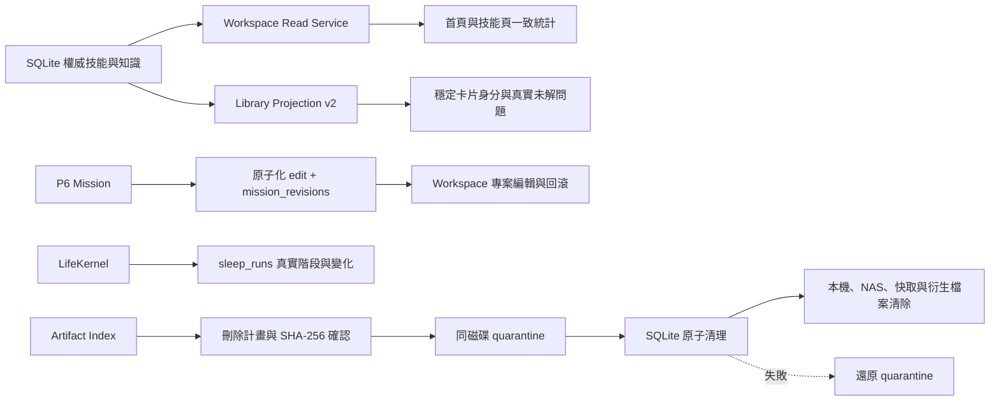

# ECK Workspace 全面品質稽核

狀態：Implemented，等待建立者最終驗收。

## 目標與持久化追蹤

- 持久化驗收 mission：`mission_d86fff81c8434c58b042dcbd628e7dba`
- 已取消的重複自動草案：`mission_abe9c461117345c99b6f78b128a4a1d0`
- 修改前 tag：`rollback-eck-workspace-quality-audit-20260812`
- 修改前 commit：`c7f57ac7be82daf8f197fa276754a000c7ce0b77`
- 修正前證據：`deliverables/quality-audit/baseline-evidence.md`
- 三輪審查：`deliverables/quality-audit/review-round-1.md` 至
  `deliverables/quality-audit/review-round-3.md`

此稽核不建立第二套任務、技能、知識或成果權威資料。所有新表只保存編輯歷史、
睡眠執行紀錄與刪除稽核紀錄。

## 資料流

## 修正內容

### 統計一致性

首頁「可用技能」與技能頁共用 lifecycle active 定義。原本的全部記憶技能數仍以
`total_memory_skills` 提供，既有 `count_skills()` 無參數行為不變。

### Library 品質

Library 對完全相同的正規化主張建立一張穩定卡片，保留所有 knowledge/task ID、
來源與出現次數。工作流程指示不再被當成未解問題；只有問句或明確表示未知、待查、
待驗證及證據不足的內容才計入。領域同步會原子替換卡片綁定並保留既有穩定主鍵。

### 專案編輯與回滾

每次 PATCH 同一交易更新 mission 並新增 `mission_revisions`。修改原因、修改欄位、
前後快照、操作者及回滾來源均持久化。回滾本身也建立新版本，不覆寫歷史；已通過或
取消的專案仍維持不可變。前端草稿沿用 Workspace draft store，刷新不會清除。

### 睡眠整理

`sleep_runs` 保存 queued、事件鏈驗證、權威記憶量測、完成或失敗階段，以及 before、
after、delta、結果和錯誤。介面只在使用者明確啟動後短暫追蹤，不建立閒置輪詢。
重啟時 running 紀錄標記中斷，queued 紀錄會恢復執行。現階段沒有虛構的記憶壓縮：
若沒有配置破壞性整理動作，結果會明確記錄 `consolidation_actions: []`。

### 成果徹底刪除

刪除前產生包含本機、NAS、快取、sidecar、manifest、preview 與衍生成果閉包的計畫，
並要求最新計畫 SHA-256 與成果完整名稱。NAS 離線、快取使用中或路徑離開安全根目錄
時拒絕刪除。檔案先原子搬入同磁碟 quarantine；資料庫交易成功後才清除 quarantine，
交易失敗則還原檔案。大型檔案內容從未寫入 SQLite。

### 額外稽核修正

- 成果封存篩選改用真實 `storage_state`，不再使用永遠不會出現的 archived status。
- 成果建立時間優先採 sidecar 時間，否則採檔案 mtime；重新索引不再全部變成同一時間。
- 日期結束篩選涵蓋指定日期全天。
- 專案載入更多後仍會在背景刷新已載入範圍，不會永久停在舊狀態。
- NAS 還原成功後立即重讀成果詳情，避免顯示過期狀態。

## 新增相容表

- `mission_revisions`
- `sleep_runs`
- `artifact_deletion_runs`

初始化只使用 `CREATE TABLE IF NOT EXISTS` 與索引建立。舊資料副本驗證要求資料列、
既有 schema、來源檔案雜湊與回滾副本都保持完整。

## REST API

- `GET /v1/missions/{mission_id}/revisions`
- `POST /v1/missions/{mission_id}/revisions/{revision_id}/rollback`
- `GET /v1/kernel/sleep/status`
- `GET /v1/workspace/results/{artifact_id}/deletion-plan`
- `DELETE /v1/workspace/results/{artifact_id}`

既有 mission PATCH、sleep POST、成果列表與技能格式保留；回應只增加相容欄位。

## 驗收原則

只有 Ruff、strict MyPy、完整 pytest、TypeScript 型別檢查、前端測試、建置、效能門檻
與實際瀏覽器回歸全部通過，才能把 P6 mission 送到 `awaiting_review`。最終狀態必須由
建立者驗收，系統不得自行標記 approved。
